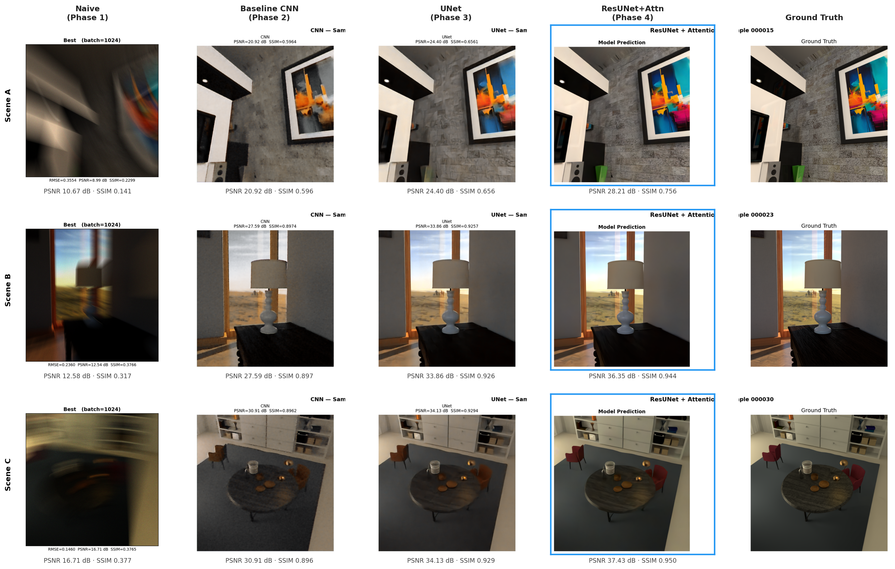

# Single Photon Image Reconstruction

> Progressive deep learning pipeline that recovers clean RGB images from binary
> single-photon camera data - built from scratch across four phases, from a
> no-learning baseline to a 237M-parameter attention-gated ResUNet.

[](https://singlephotonchallenge.com/)
[](https://pytorch.org/)
[](https://www.python.org/)

---

## What This Project Demonstrates

- Designing and training deep learning models end-to-end for a real inverse imaging problem
- Progressive experimental methodology - each phase is motivated by the previous one's failures
- Architectural progression from flat CNN -> UNet -> Residual Attention UNet
- Production-grade training: mixed precision, gradient clipping, cosine warm restarts,
  deep supervision annealing, TensorBoard logging, checkpoint resumption
- Quantitative evaluation (PSNR / SSIM) with consistent held-out test scenes across all phases

---

## The Problem

Single-photon cameras detect individual photons - each pixel fires binary (0 or 1) per
exposure. A burst of such frames is extremely sparse and shot-noise dominated. The task
is to recover the clean scene behind the noise, which has applications in low-light
photography, LiDAR, medical imaging, and space telescope imaging.

---

## Visual Progression

All four phases evaluated on the same three scenes.



---

## Results

Evaluated on 3 held-out scenes common across all phases.

| Phase | Model | Avg PSNR | Avg SSIM | Params |
|:-----:|-------|:--------:|:--------:|-------:|
| 1 | Naive Summation | 13.32 dB | 0.2783 | - |
| 2 | Baseline CNN | 26.47 dB | 0.7967 | ~1.7M |
| 3 | UNet | 30.80 dB | 0.8371 | ~31M |
| **4** | **ResUNet + Attention** | **34.00 dB** | **0.8833** | ~237M |

**+20.68 dB total PSNR improvement** from analytical baseline to final model.

### Per-scene breakdown

| Scene | Phase 1 | Phase 2 | Phase 3 | Phase 4 | Total gain |
|-------|:-------:|:-------:|:-------:|:-------:|:----------:|
| Scene A (000015) | 10.67 dB | 20.92 dB | 24.40 dB | 28.21 dB | **+17.54 dB** |
| Scene B (000023) | 12.58 dB | 27.59 dB | 33.86 dB | 36.35 dB | **+23.77 dB** |
| Scene C (000030) | 16.71 dB | 30.91 dB | 34.13 dB | 37.43 dB | **+20.72 dB** |

Scene A is the hardest - a dark room with stone wall texture and a colourful painting.
Scene B and C are well-lit with cleaner structure, where learned models benefit most.

---

## Repository Structure

```
single-photon-reconstruction/
├── phase1_naive/
│   ├── naive_reconstruction.py
│   └── results/
├── phase2_baseline_cnn/
│   ├── cnn_reconstruction.py
│   └── results/
├── phase3_unet/
│   ├── unet_reconstruction.py
│   └── results/
├── phase4_resunet_attention/
│   ├── resunet_reconstruction.py
│   └── results/
├── assets/
└── requirements.txt
```

---

## Phase Summary

**[Phase 1 - Naive Summation](./phase1_naive/README.md)**
No learning. Accumulate binary frames, normalize, measure. Establishes the performance
floor and motivates why a learned prior is necessary.

**[Phase 2 - Baseline CNN](./phase2_baseline_cnn/README.md)**
First trained model. 128 SPC frames stacked into 384 input channels, passed through a
flat 8-layer CNN. Demonstrates that learning to combine frames far outperforms any fixed
summation rule (+13.15 dB over Phase 1).

**[Phase 3 - UNet](./phase3_unet/README.md)**
Encoder-decoder with skip connections. Introduces multi-scale feature learning,
Charbonnier + MS-SSIM + VGG perceptual loss, mixed precision training, data augmentation,
and a proper train/val/test split. +4.33 dB over Phase 2.

**[Phase 4 - ResUNet + Attention](./phase4_resunet_attention/README.md)**
Final model. Residual conv blocks, 5-level encoder, 2048-channel double bottleneck,
guided attention gates on every skip connection, deep supervision with linear weight
annealing, and an edge loss term. Trained on 1850 samples on a dedicated server.
+3.20 dB over Phase 3.

---

## Setup

```bash
git clone https://github.com/your-username/single-photon-reconstruction.git
cd single-photon-reconstruction
pip install -r requirements.txt
```

Each phase folder contains its own running instructions and dataset path configuration.
Phases 1–3 run on a standard Kaggle GPU. Phase 4 requires ~40GB VRAM.

---

## Dataset

[The Single Photon Challenge](https://singlephotonchallenge.com/) - synthetic indoor
scenes rendered with a physically accurate SPC simulator. Input: binary photon bursts
as bit-packed `.npy` files `(1024, H, W, 100, 3)`. Target: ground truth RGB images.

```bibtex
@software{visionsim,
    author  = {Jungerman, Sacha and Gupta, Shantanu and Sadekar, Kaustubh
               and Leblang, Max and Gupta, Mohit},
    title   = {{visionsim}},
    url     = {https://github.com/WISION-Lab/visionsim},
    year    = {2025}
}
```