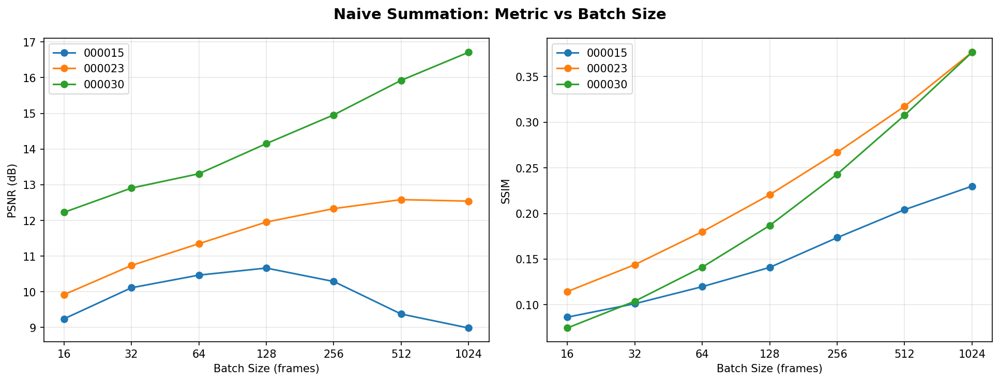
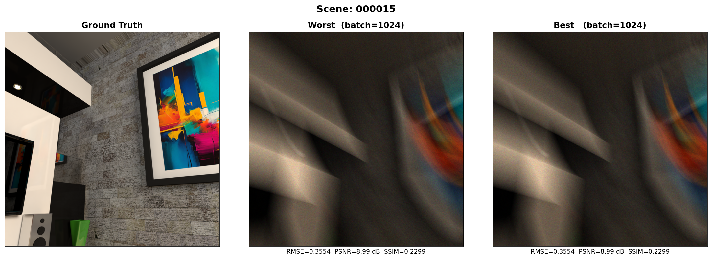
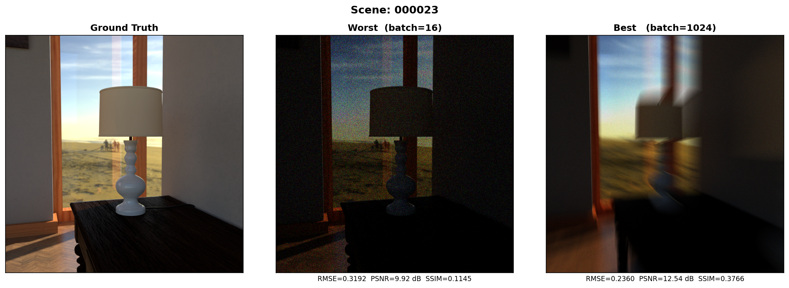
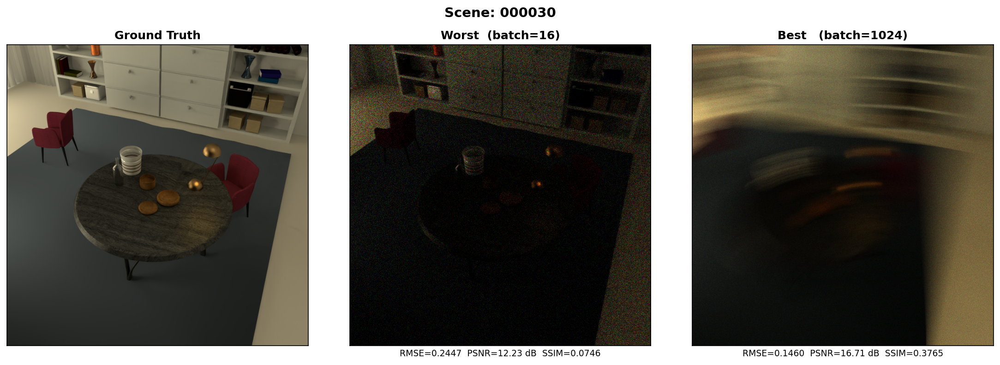

# Phase 1 - Naive Summation Baseline

← [Back](../README.md) | [Phase 2 ->](../phase2_baseline_cnn/README.md)

> **What this phase shows:** Experimental rigour - before training any model, establishing
> a reproducible analytical baseline to understand the data and measure how much improvement
> learning actually provides.

No learning, no parameters. Binary photon frames are accumulated and normalized to recover
approximate scene intensity. A sweep across batch sizes from 16 to 1024 shows where
diminishing returns begin. This sets the measurable performance floor for every subsequent
model.

---

## Why Start Here

Skipping straight to a neural network makes it impossible to know whether improvements
come from the model or from the data representation itself. This phase answers three
questions before any training begins:

- How much scene information is recoverable from raw photon counts alone?
- How does reconstruction quality change as more frames are accumulated?
- What is the gap that a learned model must close?

The result (**13.32 dB PSNR, 0.2783 SSIM**) becomes the reference every later phase is
measured against.

---

## How It Works

SPC files are bit-packed with shape `(1024, H, W, 100, 3)`. The last B frames are selected,
bits are unpacked (`np.unpackbits` on axis=2, expanding 100 bytes -> 800 spatial bins),
summed across frames, and normalized to [0, 1].

```
.npy (1024, 800, 100, 3)
  -> slice last B frames    (B, 800, 100, 3)
  -> unpackbits axis=2      (B, 800, 800, 3)
  -> sum across frames      (800, 800, 3)
  -> normalize to [0, 1]
```

No learnable parameters. No optimization. Fully deterministic.

---

## Code

**`naive_reconstruction.py`**

| Function | What it does |
|----------|-------------|
| `load_and_unpack(npy_path, batch_size)` | Loads, unpacks, sums, and normalizes one scene at a given batch size |
| `evaluate_batch_sizes(npy_path, gt_path, batch_sizes)` | Runs reconstruction for all batch sizes and computes RMSE, PSNR, SSIM |
| `show_comparisons(...)` | 3-panel figure: Ground Truth \| Worst \| Best reconstruction |
| `save_metric_curves(all_metrics)` | PSNR and SSIM vs batch size across all scenes |
| `print_metrics(results)` | Prints metric table to terminal |

---

## Running

```bash
pip install numpy matplotlib imageio scikit-image
python naive_reconstruction.py
```

Update the `SCENES` dict at the top of the script with your dataset paths before running.

**Output** -> `results/comparison_{scene}.png`, `results/metric_curves.png`, `results/metrics.json`

---

## Results

### Common evaluation scenes (000015, 000023, 000030)

The same three scenes are held out and evaluated identically across all four phases,
making cross-phase comparisons directly meaningful.

| Scene | Best Batch | RMSE ↓ | PSNR ↑ | SSIM ↑ |
|:-----:|:----------:|:------:|:------:|:------:|
| 000015 | 128  | 0.2929 | 10.67 dB | 0.1409 |
| 000023 | 512  | 0.2349 | 12.58 dB | 0.3174 |
| 000030 | 1024 | 0.1460 | 16.71 dB | 0.3765 |
| **Avg** | | | **13.32 dB** | **0.2783** |



| 000015 | 000023 | 000030 |
|:------:|:------:|:------:|
|  |  |  |

---

### Additional scenes (bathroom1, attic, bedroom1)

| Scene | Best Batch | PSNR ↑ | SSIM ↑ |
|:-----:|:----------:|:------:|:------:|
| bathroom1 | 1024 | 15.27 dB | 0.3910 |
| attic     | 256  | 21.55 dB | 0.4142 |
| bedroom1  | 256  | 12.00 dB | 0.2287 |


| bathroom1 | attic | bedroom1 |
|:---------:|:-----:|:--------:|
|  |  |  |

---

## Key Findings

**More frames helps structurally but not always pixel-wise.** SSIM climbs consistently
across all scenes as more frames are accumulated. PSNR tells a different story - dark
scenes (bathroom1, bedroom1) improve steadily, while scenes with large bright regions
(attic, 000023) peak around batch=256–512 then decline slightly. Excessive accumulation
causes bright areas to dominate normalization, hurting per-pixel accuracy even as
structural similarity improves.

**The ceiling is low and predictable.** Best PSNR stays under 21.6 dB on original
scenes and under 16.8 dB on the harder common scenes. Edges, textures, and fine detail
remain blurry regardless of frame count. This is the fundamental limit of summation
without a learned image prior - and the motivation for Phase 2.

---

← [Back](../README.md) | [Phase 2 ->](../phase2_baseline_cnn/README.md)