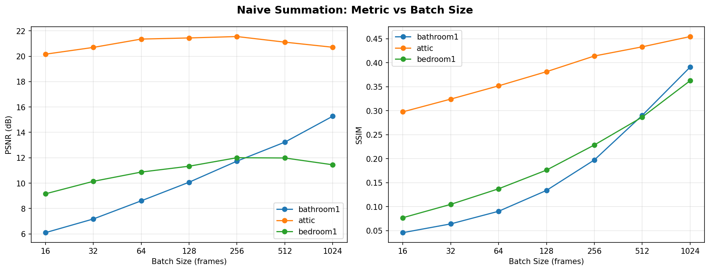
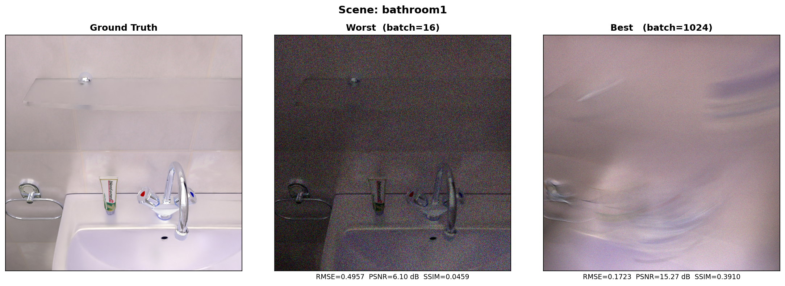
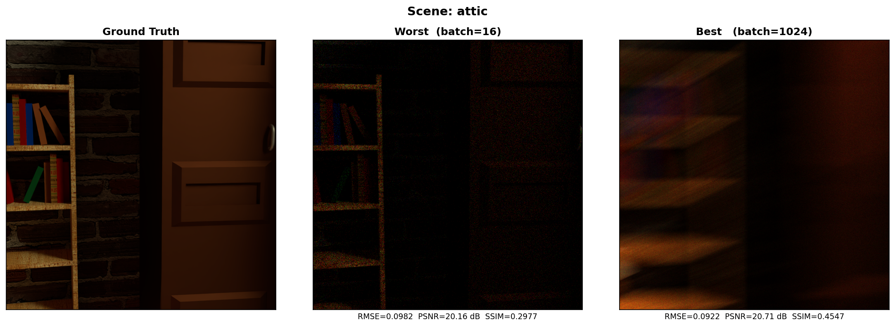
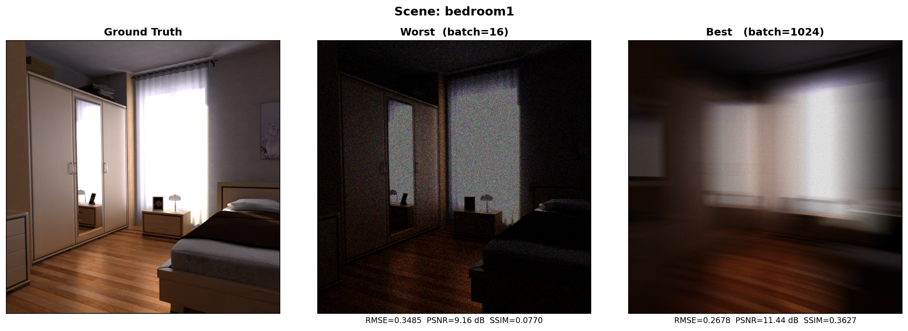

# Phase 1 — Naive Summation Baseline

> No learning involved. Sum photon frames across a burst to recover scene intensity.

← [Back to main repo](../README.md) | [Phase 2 →](../phase2_baseline_cnn/README.md)

---

## 📌 Overview

Before training any model, we establish a **parameter-free baseline**. The Single Photon Camera (SPC) captures binary frames — each pixel records whether a photon was detected. Summing many such frames gives an approximation of the true scene intensity.

This phase sweeps over different **batch sizes** (number of frames summed) to see how reconstruction quality scales with more photon data.

---

## 🔧 How It Works

```
Input: .npy file — shape (1024, H, W, 100, 3)
       │
       ├── Memory-map the file  (no full RAM load)
       ├── Slice last B frames  (B = 16 … 1024)
       ├── Unpack bit-packed bins  (np.unpackbits)
       └── Sum across frames → normalize to [0, 1]
              │
              ▼
Output: Reconstructed image — shape (800, 800, 3)
```

No convolutions. No weights. Just physics.

---

## 📂 Files

| File | Description |
|------|-------------|
| `naive_reconstruction.py` | Full script: data loading, evaluation, plots, JSON export |
| `results/metrics.json` | All RMSE / PSNR / SSIM numbers across scenes and batch sizes |
| `results/comparison_*.png` | Ground Truth vs Worst vs Best panels per scene |
| `results/metric_curves.png` | PSNR & SSIM vs batch size across all scenes |

---

## ▶️ Usage

```bash
python naive_reconstruction.py
```

Update the `SCENES` dict at the top of the file if your dataset path differs.

---

## 📊 Results

### bathroom1

| Batch Size | RMSE ↓ | PSNR ↑ | SSIM ↑ |
|:----------:|:------:|:------:|:------:|
| 16  | 0.4957 |  6.10 dB | 0.0459 |
| 32  | 0.4379 |  7.17 dB | 0.0641 |
| 64  | 0.3714 |  8.60 dB | 0.0905 |
| 128 | 0.3137 | 10.07 dB | 0.1339 |
| 256 | 0.2591 | 11.73 dB | 0.1975 |
| 512 | 0.2181 | 13.23 dB | 0.2904 |
| **1024** | **0.1723** | **15.27 dB** | **0.3910** |

### attic

| Batch Size | RMSE ↓ | PSNR ↑ | SSIM ↑ |
|:----------:|:------:|:------:|:------:|
| 16  | 0.0982 | 20.16 dB | 0.2977 |
| 32  | 0.0923 | 20.69 dB | 0.3243 |
| 64  | 0.0856 | 21.35 dB | 0.3519 |
| 128 | 0.0847 | 21.44 dB | 0.3815 |
| **256** | **0.0836** | **21.55 dB** | 0.4142 |
| 512 | 0.0880 | 21.11 dB | 0.4333 |
| 1024 | 0.0922 | 20.71 dB | **0.4547** |

### bedroom1

| Batch Size | RMSE ↓ | PSNR ↑ | SSIM ↑ |
|:----------:|:------:|:------:|:------:|
| 16  | 0.3485 |  9.16 dB | 0.0770 |
| 32  | 0.3112 | 10.14 dB | 0.1049 |
| 64  | 0.2861 | 10.87 dB | 0.1373 |
| 128 | 0.2713 | 11.33 dB | 0.1763 |
| **256** | **0.2511** | **12.00 dB** | 0.2287 |
| 512 | 0.2517 | 11.98 dB | 0.2868 |
| 1024 | 0.2678 | 11.44 dB | **0.3627** |

---

## 🖼️ Visual Results



| bathroom1 | attic | bedroom1 |
|:---------:|:-----:|:--------:|
|  |  |  |

---

## 💡 Key Takeaways

- **bathroom1 & bedroom1** improve steadily with more frames — PSNR peaks at 1024 and 256 respectively.
- **attic** peaks in PSNR at batch=256 then drops slightly — it is a brighter scene that saturates faster with more frames, but SSIM still climbs to 1024.
- Even at the best batch size, PSNR stays below **21.6 dB** and SSIM below **0.46** — summing alone cannot recover sharp edges or fine texture.
- This sets the performance floor all learned models in Phases 2–4 must beat.

---

← [Back to main repo](../README.md) | [Phase 2 →](../phase2_baseline_cnn/README.md)
