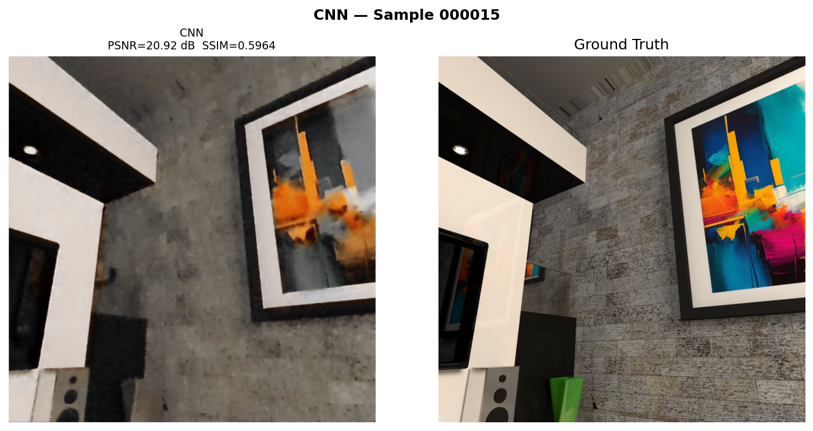
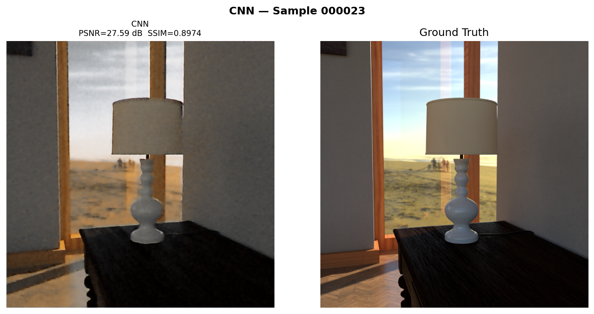
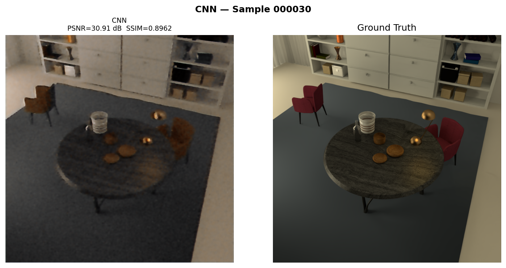
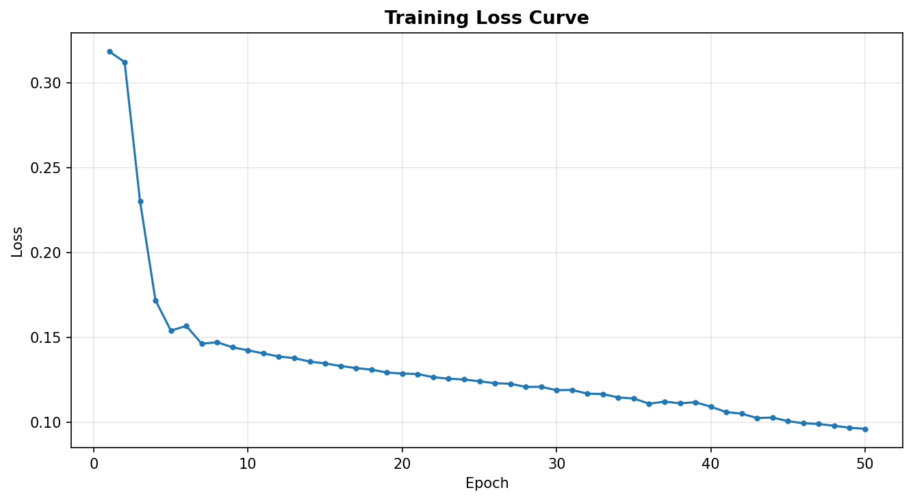
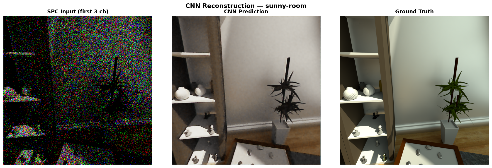
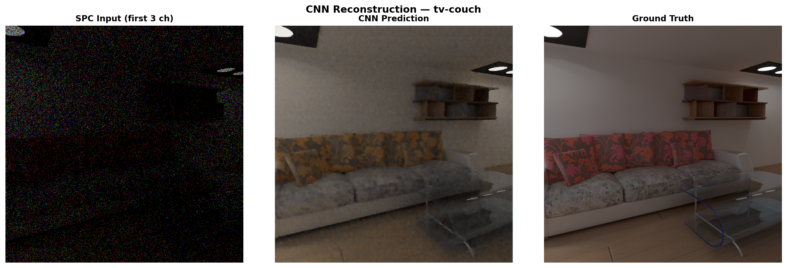
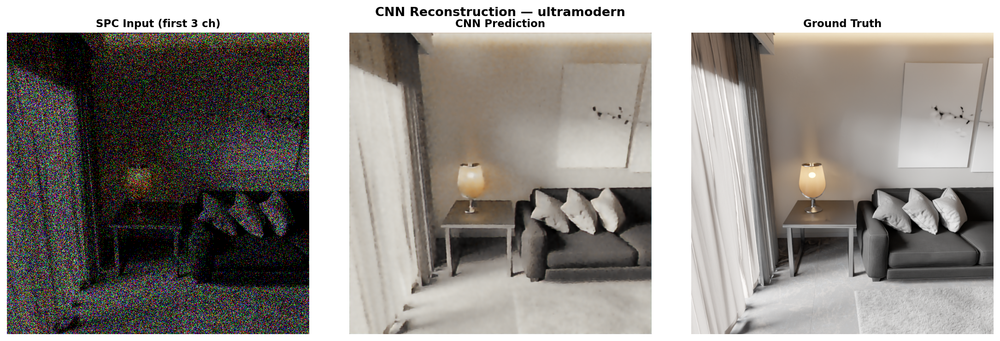
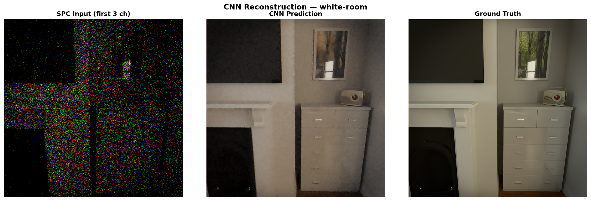
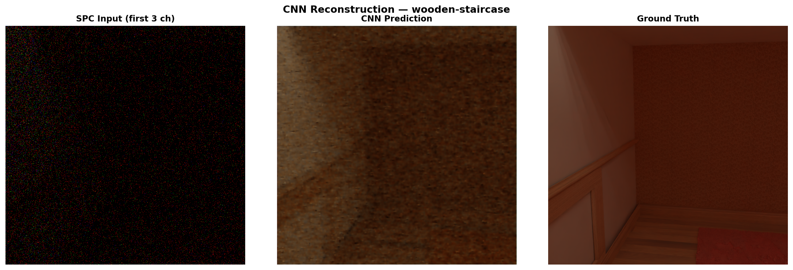

# Phase 2 — Baseline CNN

← [Phase 1](../phase1_naive/README.md) | [Back](../README.md) | [Phase 3 →](../phase3_unet/README.md)

First trained model. All 128 SPC frames are stacked into 384 input channels and passed
through a flat 8-layer CNN at full resolution. No downsampling, no skip connections.
Establishes a learned baseline for Phase 3 to improve on.

---

## Input Representation

Rather than summarizing frames (as Phase 1 did by summing), we preserve all 128 and let
the network learn how to combine them. Each frame contributes 3 channels (RGB), giving
128 × 3 = 384 input channels.

```
.npy (1024, 800, 100, 3)
  → slice last 128 frames    (128, 800, 100, 3)
  → unpackbits axis=2        (128, 800, 800, 3)
  → reshape + transpose      (384, 800, 800)     ← CNN input
```

---

## Architecture — `SimCNN`

8 convolutional layers, all 3×3 with padding=1 (spatial resolution preserved throughout).

```
(384, 800, 800) → Conv+ReLU ×7 → Conv+Sigmoid → (3, 800, 800)
Channel progression: 384→128→256→256→128→64→32→16→3
```

~1.72M parameters.

---

## Loss & Training

```
Loss = 0.5 × L1  +  0.5 × (1 − SSIM)
```

L1 alone produces blurry outputs — SSIM adds structural supervision. Adam, lr=1e-4,
50 epochs, sample-by-sample (batch size 1). 45 train / 5 test samples.

---

## Code

**`cnn_reconstruction.py`**

| Function / Class | What it does |
|-----------------|-------------|
| `unpack_last_frame(npy_path)` | Loads SPC data, unpacks bits, reshapes to (800, 800, 384), normalizes |
| `SimCNN` | The model — 8 conv layers, expand then contract, Sigmoid output |
| `save_comparison(...)` | 3-panel figure: Input \| Model Output \| Ground Truth |
| `save_loss_curve(epoch_losses)` | Plots loss vs epoch |
| `print_summary(results)` | Prints per-sample and average PSNR/SSIM to terminal |

---

## Running

```bash
pip install torch torchvision torchmetrics scikit-image matplotlib Pillow
python cnn_reconstruction.py
```

Update `DATA_ROOT` at the top. Model saved to `results/cnn_model.pth`.

---

## Results

### Common evaluation scenes (000015, 000023, 000030)

Used across all phases for direct comparison.

| Scene | PSNR ↑ | SSIM ↑ |
|:-----:|:------:|:------:|
| 000015 | 20.92 dB | 0.5964 |
| 000023 | 27.59 dB | 0.8974 |
| 000030 | 30.91 dB | 0.8962 |
| **Avg** | **26.47 dB** | **0.7967** |

**vs Phase 1:** +13.15 dB PSNR, +0.518 SSIM

| 000015 | 000023 | 000030 |
|:------:|:------:|:------:|
|  |  |  |

---

### Original test scenes (sunny-room, tv-couch, ultramodern, white-room, wooden-staircase)

| Sample | Scene | PSNR ↑ | SSIM ↑ |
|:------:|-------|:------:|:------:|
| 0 | sunny-room | 27.21 dB | 0.8922 |
| 1 | tv-couch | 32.09 dB | 0.8851 |
| 2 | ultramodern | 27.57 dB | 0.8202 |
| 3 | white-room | 31.20 dB | 0.9102 |
| 4 | wooden-staircase | 29.60 dB | 0.8442 |
| **Avg** | | **29.54 dB** | **0.8704** |



| sunny-room | tv-couch | ultramodern |
|:----------:|:--------:|:-----------:|
|  |  |  |

| white-room | wooden-staircase |
|:----------:|:----------------:|
|  |  |

---

## Observations

The jump from Phase 1 is large (+13.15 dB on common scenes) — preserving all 128 frames
as separate channels and learning to combine them far outperforms any fixed summation rule.

The loss curve is still declining at epoch 50, meaning the model hasn't fully converged.
These numbers are a lower bound on what this architecture can achieve.

PSNR varies significantly across scenes — 000015 scores only 20.92 dB while 000030 reaches
30.91 dB. The flat CNN processes every spatial location identically with no mechanism for
multi-scale reasoning, which hurts on complex scenes with fine texture and challenging
lighting. That is exactly what UNet's skip connections address in Phase 3.

---

← [Phase 1](../phase1_naive/README.md) | [Back](../README.md) | [Phase 3 →](../phase3_unet/README.md)