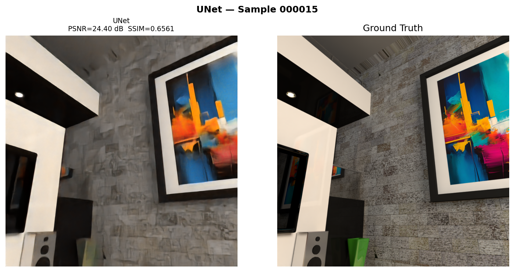
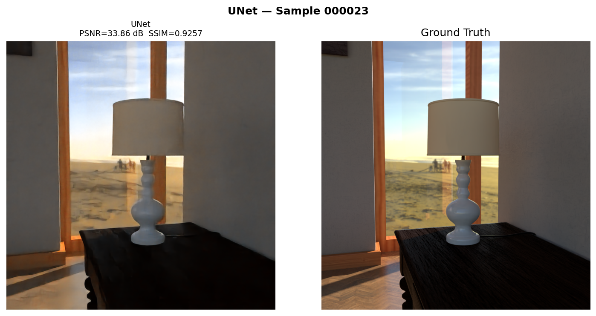
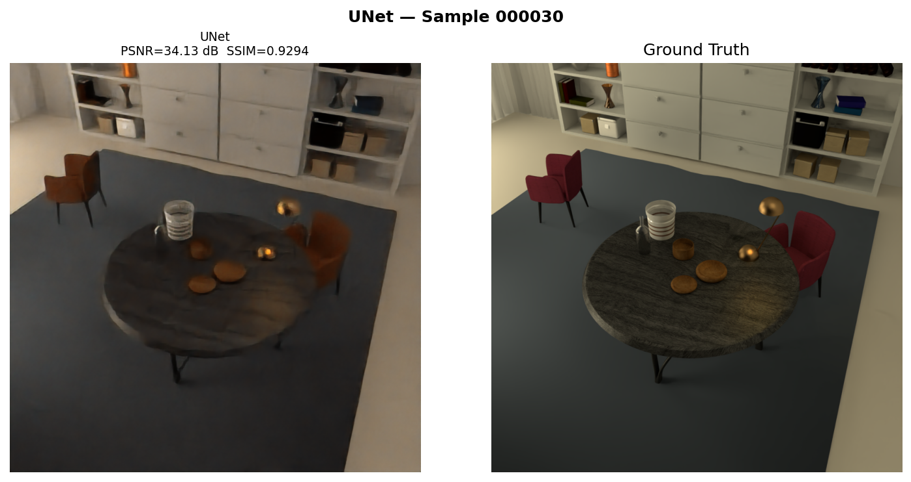
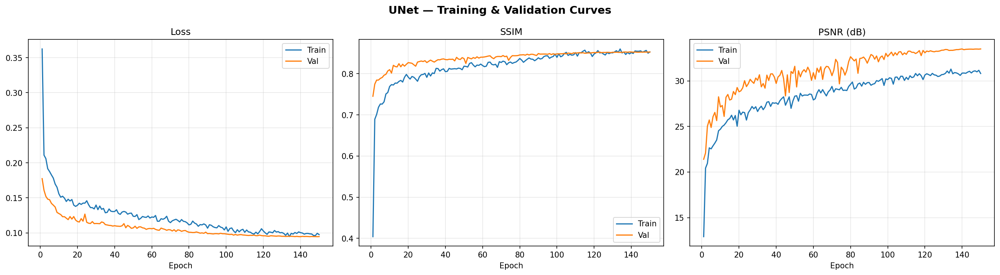
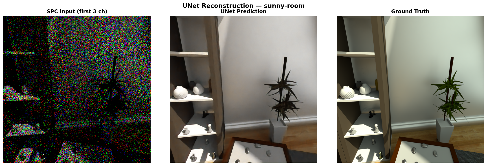
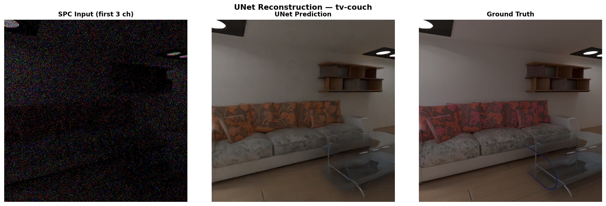
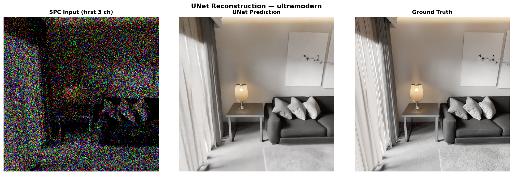
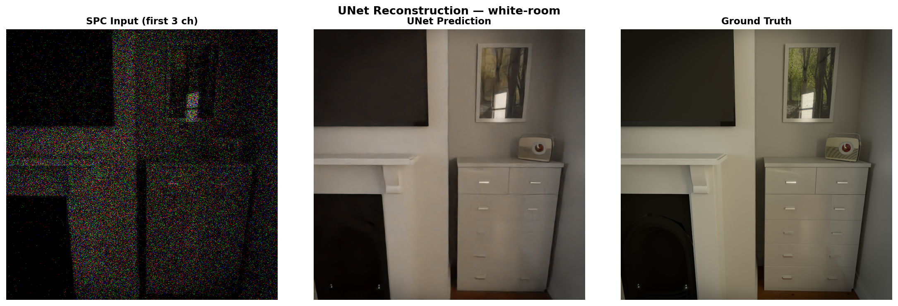
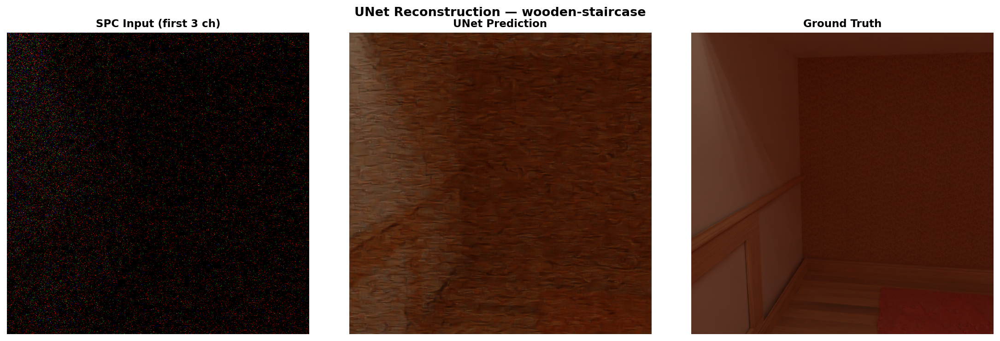

# Phase 3 - UNet

← [Phase 2](../phase2_baseline_cnn/README.md) | [Back](../README.md) | [Phase 4 ->](../phase4_resunet_attention/README.md)

Encoder-decoder with skip connections. The encoder compresses spatial resolution to build
global scene understanding; skip connections feed spatial detail directly to the decoder
at each level. Also introduces a significantly upgraded training pipeline over Phase 2.

---

## What Changed from Phase 2

| | Phase 2 | Phase 3 |
|--|---------|---------|
| Architecture | Flat CNN, single scale | UNet, 3 encoder levels + bottleneck |
| Skip connections | None | Encoder -> decoder at each level |
| Parameters | ~1.7M | ~31M |
| Loss | L1 + SSIM | Charbonnier + MS-SSIM + VGG |
| LR schedule | Fixed 1e-4 | Cosine annealing (1e-4 -> 1e-6) |
| Precision | FP32 | Mixed precision (FP16) |
| Augmentation | None | Flips, rotations, 512×512 random crop |
| Validation | None | 80 / 10 / 10 train/val/test split |
| Epochs | 50 | 150 |

---

## Architecture - `UNetBasic`

```
Input (384, 800, 800)
  enc1 -> pool -> enc2 -> pool -> enc3 -> pool -> bottleneck
                                              ↓
  dec3 ← up + cat(enc3) ← dec2 ← up + cat(enc2) ← dec1 ← up + cat(enc1)
  ↓
  Conv1×1 -> (3, 800, 800)

Channels: 384->128->256->512->1024 (bottleneck) ->512->256->128->3
```

Upsampling via learned `ConvTranspose2d`. ~31M parameters.

---

## Loss Function

```
Loss = 0.25 × Charbonnier  +  0.50 × (1 − MS-SSIM)  +  0.25 × VGG Perceptual
```

**Charbonnier** - smooth L1, differentiable at zero, more stable near convergence.

**MS-SSIM** - structural similarity at multiple scales; more robust for scenes with both
large surfaces and fine texture.

**VGG Perceptual** - L1 distance between VGG16 feature maps at relu1_2 / relu2_2 / relu3_3
(weights 0.2 / 0.3 / 0.5). Pushes the model toward perceptually sharp outputs.

---

## Training Configuration

| Parameter | Value |
|-----------|-------|
| Optimizer | Adam |
| Learning Rate | 1e-4 -> 1e-6 cosine annealing |
| Epochs | 150 |
| Batch Size | 1 |
| Gradient Clipping | max norm 1.0 |
| Precision | FP16 autocast + GradScaler |
| Split | 80 / 10 / 10 |
| Checkpoint | Best val SSIM (epoch 139) |

---

## Code

**`unet_reconstruction.py`**

| Function / Class | What it does |
|-----------------|-------------|
| `unpack_last_frame(npy_path)` | Memory-maps .npy, unpacks bits, reshapes to (384, 800, 800) |
| `SPCDataset` | PyTorch Dataset - augmentation for train, full resolution for val/test |
| `CharbonnierLoss` | Smooth L1: `sqrt((pred - target)² + ε²)` |
| `VGGPerceptualLoss` | Frozen VGG16 feature extractor, L1 at three layers |
| `UNetBasic` | Encoder-decoder with ConvTranspose2d upsampling and skip connections |
| `compute_psnr(pred, target)` | Inline PSNR from MSE, used during training loop |
| `save_comparison(...)` | 3-panel figure: Input \| Model Output \| Ground Truth |
| `save_training_curves(log_csv)` | 3-panel plot: Loss, SSIM, PSNR - train and val |
| `print_summary(results)` | Prints per-sample and average PSNR/SSIM to terminal |

---

## Running

```bash
pip install torch torchvision torchmetrics scikit-image matplotlib Pillow
python unet_reconstruction.py
```

Update `DATA_ROOT` at the top. Best model saved to `checkpoints/best_model.pth`.

---

## Results

### Common evaluation scenes (000015, 000023, 000030)

Used across all phases for direct comparison.

| Scene | PSNR ↑ | SSIM ↑ |
|:-----:|:------:|:------:|
| 000015 | 24.40 dB | 0.6561 |
| 000023 | 33.86 dB | 0.9257 |
| 000030 | 34.13 dB | 0.9294 |
| **Avg** | **30.80 dB** | **0.8371** |

**vs Phase 2:** +4.33 dB PSNR, +0.040 SSIM

| 000015 | 000023 | 000030 |
|:------:|:------:|:------:|
|  |  |  |

---

### Original test scenes (sunny-room, tv-couch, ultramodern, white-room, wooden-staircase)

| Sample | Scene | PSNR ↑ | SSIM ↑ |
|:------:|-------|:------:|:------:|
| 0 | sunny-room | 30.67 dB | 0.9313 |
| 1 | tv-couch | 34.76 dB | 0.9091 |
| 2 | ultramodern | 31.23 dB | 0.8596 |
| 3 | white-room | 34.66 dB | 0.9480 |
| 4 | wooden-staircase | 31.77 dB | 0.7616 |
| **Avg** | | **32.62 dB** | **0.8819** |



| sunny-room | tv-couch | ultramodern |
|:----------:|:--------:|:-----------:|
|  |  |  |

| white-room | wooden-staircase |
|:----------:|:----------------:|
|  |  |

---

## Observations

Skip connections delivered the largest gains on the hardest scenes. On the common
evaluation scenes, ultramodern (a scene with complex geometry and fine texture) gained
most from multi-scale feature reuse.

Train and val curves stay close throughout (final gap: 0.0002 SSIM), meaning augmentation
was effective despite 31M parameters. Val PSNR slightly exceeds train PSNR at the end -
training uses 512×512 crops which give less context per sample than full 800×800 val images.

`wooden-staircase` has the lowest SSIM at 0.7616 despite decent PSNR (31.77 dB).
Repetitive fine texture is hard for uniform skip-concatenation to handle - motivating the
attention gates in Phase 4.

---

← [Phase 2](../phase2_baseline_cnn/README.md) | [Back](../README.md) | [Phase 4 ->](../phase4_resunet_attention/README.md)