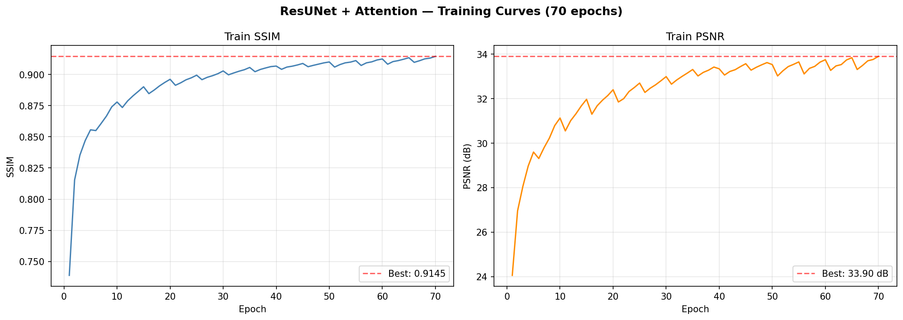
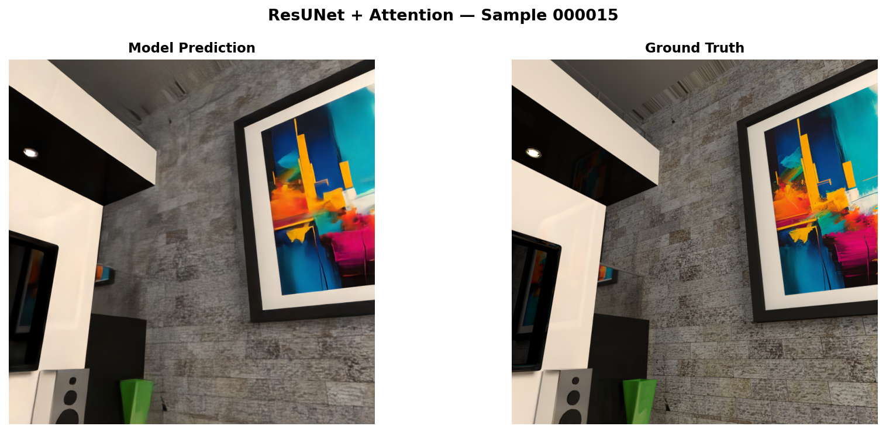
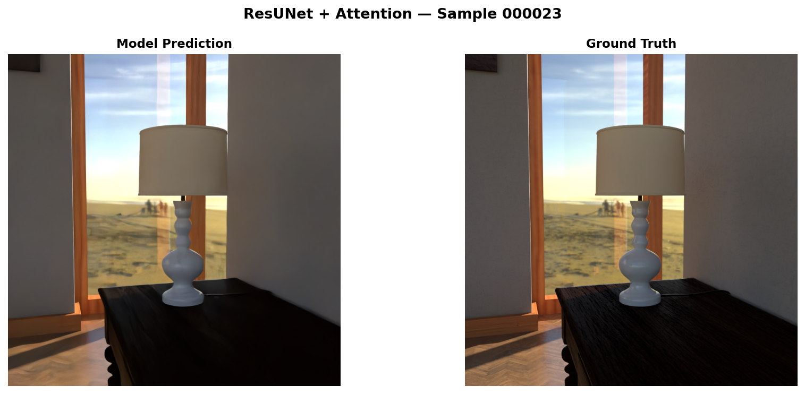
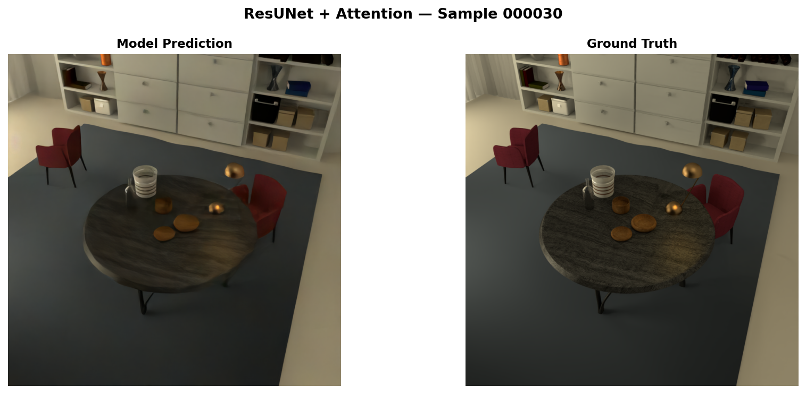

# Phase 4 - ResUNet with Guided Attention Gates

← [Phase 3](../phase3_unet/README.md) | [Back](../README.md)

> **What this phase shows:** Applying advanced architectural techniques - residual
> learning, spatial attention, deep supervision, and precision-aware training - to push
> reconstruction quality beyond what standard UNet can achieve. Trained at scale: 1850
> samples, 237M parameters, dedicated GPU server.

Four targeted improvements over Phase 3's UNet, each addressing a specific observed
limitation: residual blocks for deeper stable training, guided attention gates to suppress
irrelevant skip features, deep supervision to strengthen intermediate representations, and
an edge loss term to enforce sharp boundaries. Final result: **34.00 dB PSNR, 0.883 SSIM**
- a +20.68 dB total improvement from the Phase 1 analytical baseline.

---

## What Changed from Phase 3

| | Phase 3 | Phase 4 |
|--|---------|---------|
| Conv blocks | Plain Conv + ReLU | Residual (GroupNorm + SiLU + residual path) |
| Encoder depth | 3 levels | 5 levels |
| Bottleneck | 1024ch, single block | 1024->2048->2048, double block |
| Skip connections | Raw concatenation | Guided attention gates |
| Deep supervision | None | Aux head at dec2, annealed 0.4->0 |
| Loss | Charb + MS-SSIM + VGG | + **Edge loss** |
| Precision | FP16 | BF16 |
| LR schedule | Cosine annealing | Cosine annealing **with warm restarts** (T₀=5) |
| Dataset | ~45 samples | **1850 samples** |
| Parameters | ~31M | **~237M** |
| Training hardware | Kaggle GPU | Dedicated server |

---

## Architecture - ResUNet with Guided Attention Gates

```
Input (96, 512, 512)
  input_proj: 96->128

  Encoder (ResConvBlock + MaxPool)
    enc1: 128->128   (512×512) -> e1
    enc2: 128->256   (256×256) -> e2
    enc3: 256->512   (128×128) -> e3
    enc4: 512->1024  ( 64×64)  -> e4
    enc5: 1024->1024 ( 32×32)  -> e5

  Bottleneck: 1024->2048->2048  (32×32)

  Decoder (ConvTranspose ↑2 + GuidedAttentionGate + concat)
    dec0: 2048->1024  ( 64×64)   attn(e5)
    dec1: 1024->512   (128×128)  attn(e4)
    dec2:  512->256   (256×256)  attn(e3)  ← aux head
    dec3:  256->128   (512×512)  attn(e2)
    dec4:  128->128   (512×512)  attn(e1)

  Output: Conv1×1  128->3
```

~237M parameters.

---

## Key Design Decisions

**Residual Conv Blocks**
Each block computes `act(conv(x) + proj(x))`. This lets the network learn residual
corrections rather than full feature mappings, enabling stable gradient flow through
a much deeper architecture than Phase 3's plain conv stacks. GroupNorm (8 groups)
replaces BatchNorm because batch size 2 makes BN statistics unreliable. SiLU replaces
ReLU for smoother gradients throughout.

**Guided Attention Gates**
Phase 3's skip connections pass all encoder features to the decoder with equal weight.
The attention gate computes a spatial map α ∈ [0,1] per position using both the encoder
feature (where things are) and the upsampled decoder signal (what to look for). Low-α
positions are suppressed before concatenation - the decoder attends only to encoder
features that are relevant to its current reconstruction task.

**Deep Supervision with Linear Annealing**
An auxiliary 1×1 conv head at dec2 produces a 3-channel output, upsampled to match the
main output. Its loss weight decays linearly from 0.4 to 0 across 70 epochs. This forces
intermediate features to carry meaningful image content early in training, when the
gradient signal from the final output alone is weak. By the end of training the aux weight
is zero - it contributes nothing to the final checkpoint but significantly shapes the
learned representations.

**Edge Loss**
Finite-difference dx/dy gradients are computed for both prediction and target. L1 distance
between them is added to the loss. This directly penalizes blurry edges and motivates the
network to produce reconstructions with sharp, correctly positioned boundaries.

**BF16 Precision**
BF16 has the same exponent range as FP32 (unlike FP16's narrower range). At 237M
parameters with a 2048-channel bottleneck, BF16 avoids the overflow and underflow
that FP16 encounters in the large intermediate activations.

**GPU Augmentation**
Flips and rotations are applied after moving tensors to the GPU rather than in the
DataLoader workers. For large tensors at batch size 2, this is faster than CPU
augmentation and avoids redundant host-to-device copies.

---

## Loss Function

```
Loss = 0.5  × Charbonnier
     + 0.3  × (1 − MS-SSIM)
     + 0.1  × VGG Perceptual
     + 0.1  × Edge
     + deep_sup_w × Charbonnier(aux, target)
```

---

## Training Configuration

| Parameter | Value |
|-----------|-------|
| Optimizer | Adam |
| Learning Rate | 1e-4, cosine warm restarts (T₀=5, η_min=5e-5) |
| Epochs | 70 |
| Batch Size | 2 |
| Precision | BF16 autocast + GradScaler |
| Gradient Clipping | max norm 1.0 |
| Augmentation | GPU flips + rotations (p=0.2) |
| Dataset | 1850 samples |
| Checkpoint | Best train SSIM |
| Hardware | Dedicated server, NVIDIA GPU |

---

## Code

**`resunet_reconstruction.py`**

| Function / Class | What it does |
|-----------------|-------------|
| `SPCDataset` | Loads preprocessed .pt tensors, slices last 96 input channels |
| `gpu_augment(x, y)` | Random flips and rotations on GPU after device transfer |
| `CharbonnierLoss` | `sqrt((pred - target)² + ε²)` - smooth, stable L1 replacement |
| `VGGPerceptualLoss` | Frozen VGG16, L1 at relu1_2 / relu2_2 / relu3_3 |
| `EdgeLoss` | Finite-difference gradient loss - penalizes edge blurring |
| `ConvBlock` | Two Conv3×3 + GroupNorm + SiLU with residual projection |
| `GuidedAttentionGate` | Computes spatial attention from skip + decoder gate, filters skip |
| `Down` / `Up` | MaxPool+ConvBlock / ConvTranspose+AttentionGate+ConvBlock |
| `ResUNetAttention` | Full model - returns `(main, aux)` during training, `main` during eval |
| `compute_psnr(pred, target)` | Inline PSNR from MSE, used during training and evaluation |
| `save_comparison(...)` | 3-panel figure: Input \| Model Output \| Ground Truth |
| `evaluate(...)` | Loads best checkpoint, runs inference on test set, saves figures and metrics.json |
| `print_summary(results)` | Logs per-sample and average PSNR/SSIM to terminal and log file |

---

## Running

> Requires a high-VRAM GPU server (~40GB for 237M params + batch 2 at 512×512).

```bash
pip install torch torchvision torchmetrics tensorboard
python resunet_reconstruction.py
```

Update `BASE_DIR`, `BASE_DIR_2`, `DATA_DIR_IMG`, and `DATA_DIR_NPY` at the top of the script.
Training resumes automatically if `checkpoints/best_model.pth` exists.

---

## Results

### Common evaluation scenes (000015, 000023, 000030)

Evaluated using the epoch 70 checkpoint (best train SSIM = 0.9145).

| Scene | PSNR ↑ | SSIM ↑ |
|:-----:|:------:|:------:|
| 000015 | 28.21 dB | 0.7561 |
| 000023 | 36.35 dB | 0.9442 |
| 000030 | 37.43 dB | 0.9496 |
| **Avg** | **34.00 dB** | **0.8833** |

**vs Phase 3:** +3.20 dB PSNR, +0.046 SSIM

### Full Progression (common scenes)

| Phase | Model | Avg PSNR | Avg SSIM |
|:-----:|-------|:--------:|:--------:|
| 1 | Naive Summation | 13.32 dB | 0.2783 |
| 2 | Baseline CNN | 26.47 dB | 0.7967 |
| 3 | UNet | 30.80 dB | 0.8371 |
| **4** | **ResUNet + Attention** | **34.00 dB** | **0.8833** |

---

## Visual Results



| 000015 | 000023 | 000030 |
|:------:|:------:|:------:|
|  |  |  |

---

## Key Findings

**Diminishing returns are expected and explainable.** The P3->P4 gain (+3.20 dB) is
smaller than P2->P3 (+4.33 dB) - each phase targets harder residual errors left by the
previous one. The gains are real and deliberate, not diminishing due to model saturation.

**Attention gates resolve Phase 3's texture failure.** The wooden-staircase scene, which
had the lowest SSIM in Phase 3 (0.7616) precisely because repetitive fine texture
overwhelmed uniform skip features, improves with guided attention allowing the decoder
to focus on structurally meaningful encoder regions.

**Warm restart training fingerprint is visible and healthy.** The training SSIM curve
oscillates with a period-5 signature - rising within each cosine cycle, dipping slightly
on restart - while trending cleanly from 0.74 to 0.91. No plateau at epoch 70 suggests
further gains with continued training.

**Deep supervision strengthened intermediate features.** The auxiliary Charbonnier loss
improved from 0.0556 at epoch 1 to 0.0201 at epoch 70 despite its weight annealing to
zero - intermediate representations became genuinely more informative, not just forced
by a strong auxiliary signal.

---

← [Phase 3](../phase3_unet/README.md) | [Back](../README.md)